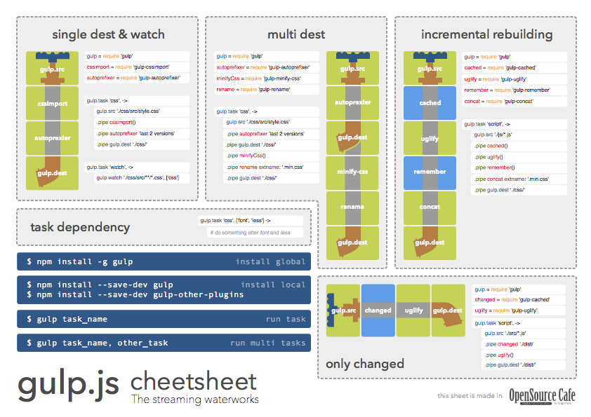
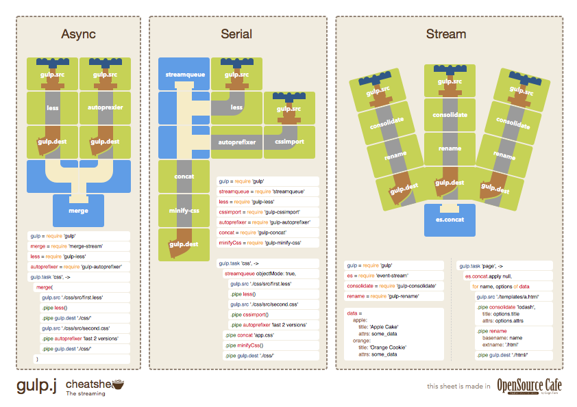

# gulp-cheetsheet

A cheetsheet for [gulp](https://github.com/gulpjs/gulp).

## Usage

- Print the PDF.
- Put it on the wall beside your pc.

## Editions

### JavaScript in English

(coming soon)

### CoffeeScript in English [p1](raw/master/dist/en-coffee-p1.pdf), [p2](raw/master/dist/en-coffee-p2.pdf)

## License

- Made in [OpenSource Cafe](http://www.osscafe.net/en/)
- By [Tsutomu Kawamura](https://github.com/cognitom)
- [CC-BY-SA 4.0](http://creativecommons.org/licenses/by-sa/4.0/)
