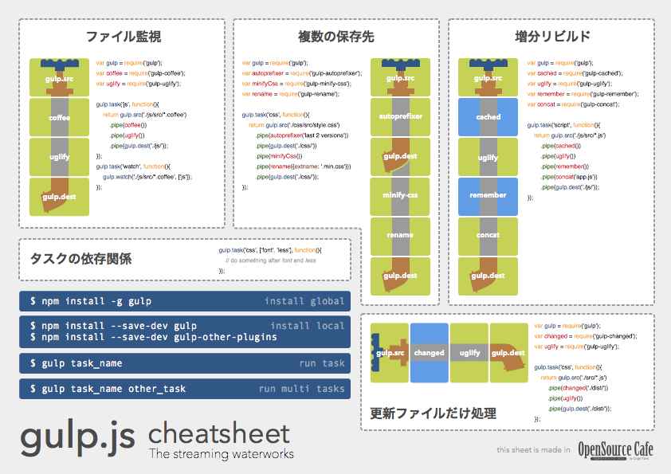

# gulp-cheatsheet

A cheatsheet for [gulp](https://github.com/gulpjs/gulp).

## Quick downloads

- English
	- **JavaScript**: [p1.pdf](https://github.com/osscafe/gulp-cheetsheet/raw/master/dist/en-js-p1.pdf) / [p2.pdf](https://github.com/osscafe/gulp-cheetsheet/raw/master/dist/en-js-p2.pdf)
	- **CoffeeScript**: [p1.pdf](https://github.com/osscafe/gulp-cheetsheet/raw/master/dist/en-coffee-p1.pdf) / [p2.pdf](https://github.com/osscafe/gulp-cheetsheet/raw/master/dist/en-coffee-p2.pdf)
- Japanese
	- **JavaScript** [p1.pdf](https://github.com/osscafe/gulp-cheetsheet/raw/master/dist/ja-js-p1.pdf) / [p2.pdf](https://github.com/osscafe/gulp-cheetsheet/raw/master/dist/ja-js-p2.pdf)

## Usage

- Print the PDF.
- Put it on the wall beside your pc :)

## Editions

|  | p.1 | p.2 |
|----|:--:|:--:|
| English / JavaScript |  |  |
| English / CoffeeScript |  |  |
| 日本語 / JavaScript |  |  |

## License

- Made in [OpenSource Cafe](http://www.osscafe.net/en/)
- By [Tsutomu Kawamura](https://github.com/cognitom)
- [CC-BY-SA 4.0](http://creativecommons.org/licenses/by-sa/4.0/)
