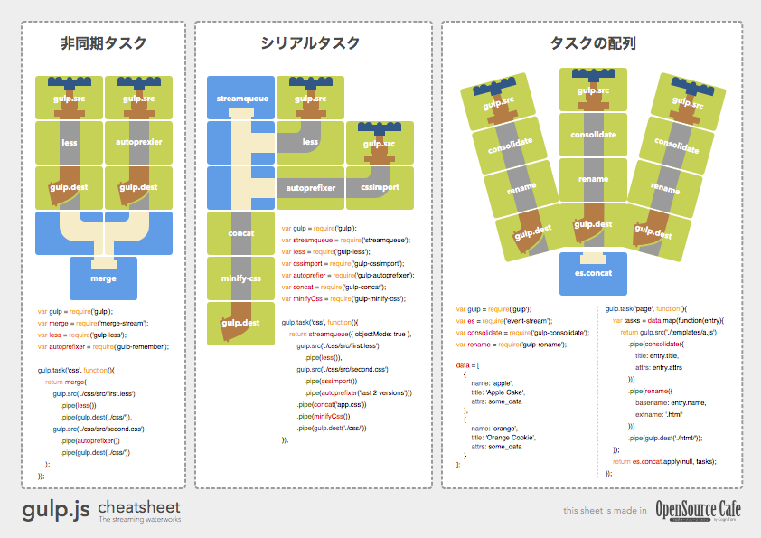

# gulp-cheatsheet

A cheatsheet for [gulp](https://github.com/gulpjs/gulp).


## Quick downloads

- English
	- **JavaScript**: [p1.pdf](https://github.com/osscafe/gulp-cheetsheet/raw/master/dist/en-js-p1.pdf) / [p2.pdf](https://github.com/osscafe/gulp-cheetsheet/raw/master/dist/en-js-p2.pdf)
	- **CoffeeScript**: [p1.pdf](https://github.com/osscafe/gulp-cheetsheet/raw/master/dist/en-coffee-p1.pdf) / [p2.pdf](https://github.com/osscafe/gulp-cheetsheet/raw/master/dist/en-coffee-p2.pdf)
- Japanese
	- **JavaScript** [p1.pdf](https://github.com/osscafe/gulp-cheetsheet/raw/master/dist/ja-js-p1.pdf) / [p2.pdf](https://github.com/osscafe/gulp-cheetsheet/raw/master/dist/ja-js-p2.pdf)


## Usage

- Print the PDF.
- Put it on the wall beside your pc :)


## Editions

|  | p.1 | p.2 |
|----|:--:|:--:|
| English /<br>JavaScript | [](https://github.com/osscafe/gulp-cheetsheet/raw/master/dist/en-js-p1.pdf) | [](https://github.com/osscafe/gulp-cheetsheet/raw/master/dist/en-js-p2.pdf) |
| English /<br>CoffeeScript | [](https://github.com/osscafe/gulp-cheetsheet/raw/master/dist/en-coffee-p1.pdf) | [](https://github.com/osscafe/gulp-cheetsheet/raw/master/dist/en-coffee-p2.pdf) |
| 日本語 /<br>JavaScript | [](https://github.com/osscafe/gulp-cheetsheet/raw/master/dist/ja-js-p1.pdf) | [](https://github.com/osscafe/gulp-cheetsheet/raw/master/dist/ja-js-p2.pdf) |


## Example codes

### Commands

- install global:
	```$ npm install -g gulp```
- install local:
	```$ npm install --save-dev gulp```
	```$ npm install --save-dev gulp-other-plugins```
- run task:
	```$ gulp task_name```
- run multi tasks:
	```$ gulp task_name other_task```


### JavaScript: gulpfile.js

- [Single Dest & Watch](examples/js/watch.js)
- [Multi Dest](examples/js/multi-dest.js)
- [Incremental Rebuilding](examples/js/incremental-rebuilding.js)
- [Only Changed](examples/js/only-changed.js)
- [Async Streams](examples/js/async-streams.js)
- [Serial Join](examples/js/serial-join.js)
- [Stream Array](examples/js/stream-array.js)

### CoffeeScript: gulpfile.coffee

- [Single Dest & Watch](examples/coffee/watch.coffee)
- [Multi Dest](examples/coffee/multi-dest.coffee)
- [Incremental Rebuilding](examples/coffee/incremental-rebuilding.coffee)
- [Only Changed](examples/coffee/only-changed.coffee)
- [Async Streams](examples/coffee/async-streams.coffee)
- [Serial Join](examples/coffee/serial-join.coffee)
- [Stream Array](examples/coffee/stream-array.coffee)


## License

- Made in [OpenSource Cafe](http://www.osscafe.net/en/)
- By [Tsutomu Kawamura](https://github.com/cognitom)
- [CC-BY-SA 4.0](http://creativecommons.org/licenses/by-sa/4.0/)


## See also

- [gulp documentation](https://github.com/gulpjs/gulp/tree/master/docs)
- [Official Recipes](https://github.com/gulpjs/gulp/tree/master/docs/recipes)
